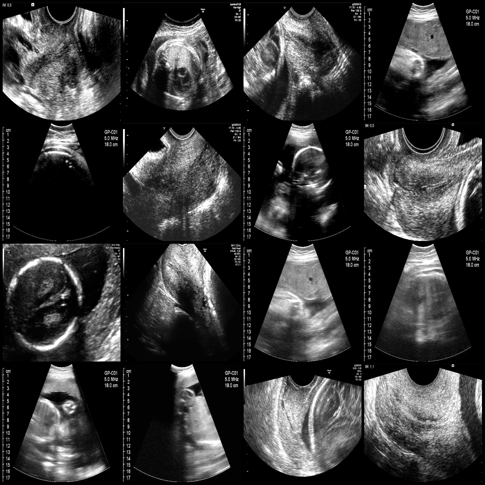
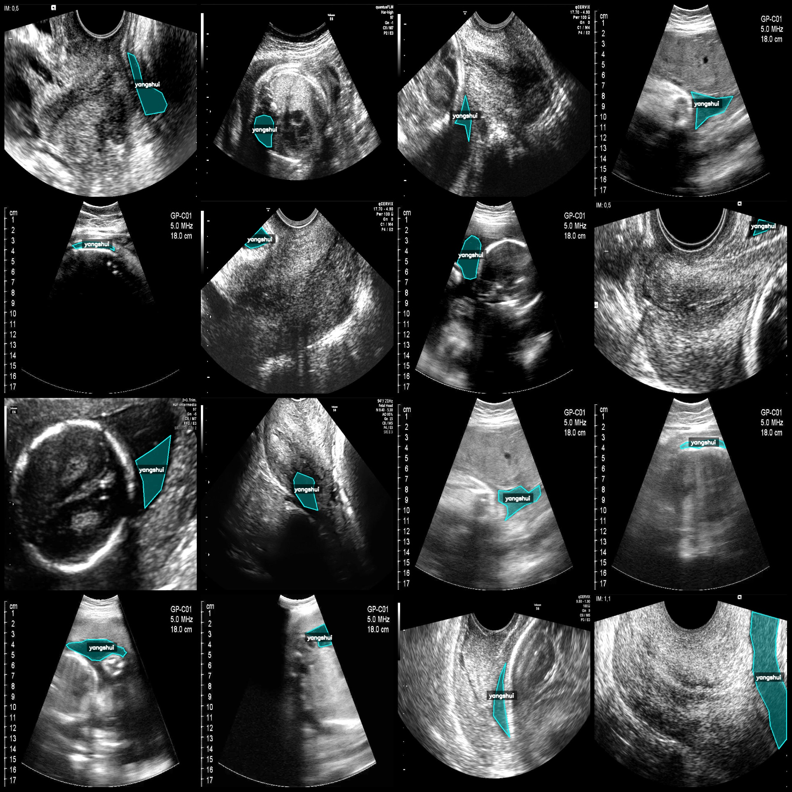
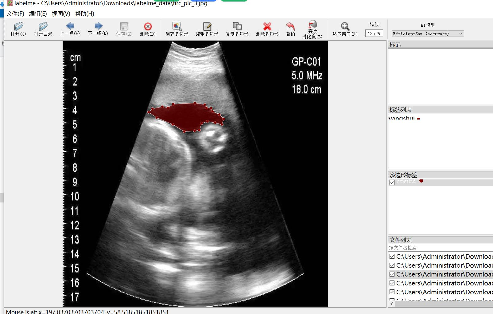

# Intelligent Medical Fetal Fluid Identification and Segmentation Dataset (labelme format)

The dataset is in labelme format without the mask file, containing only jpg images and their corresponding json files.

Image count (number of jpg files): 3200
Annotation count (json file count): 3200
Number of categories: 1
Category name: ["yangshui"]
Number of boxes per category: 4684
Labelme version used: 5.5.0
Image resolution: 640x640
Annotation rules: Polygons are drawn around the categories.
Important note: This dataset can be edited using labelme, but the json dataset must be converted to either mask or yolo or coco format for semantic segmentation or instance segmentation.
Special declaration: This dataset does not guarantee the accuracy of the trained model or weight files.

Image preview:
Annotation example:
Original image (randomly selected 16 images):
Annotation drawing results:
Labelme editing image example:

## Images

Here is a pay link on Stripe ( https://buy.stripe.com/3cs8yP7sY87d0vu9AB ). Please contact me lonlonago@foxmail.com after funding $89, and I will send you a complete data files , thank you!

